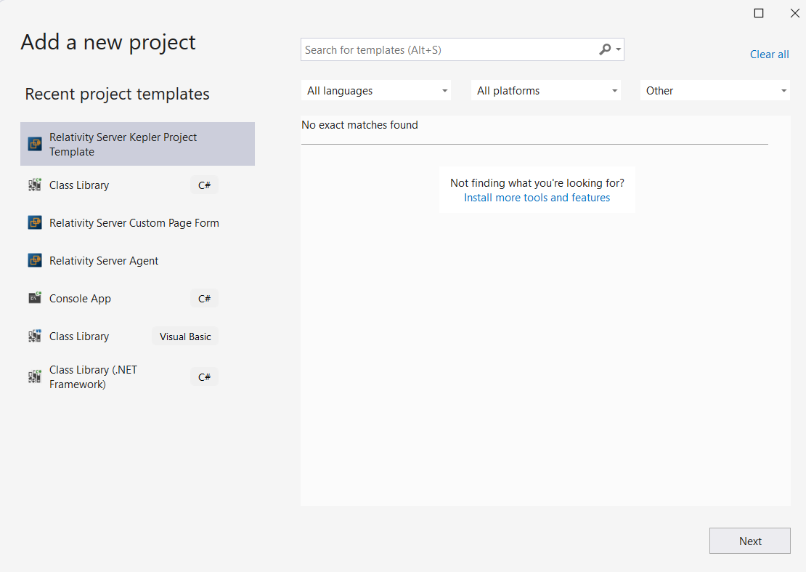

# server-relativity-templates
The Relativity Server Templates are compatible with Visual Studio 2022 and consist of Project Templates as well as templates for individual files.

---

## Installation

To install all of the templates:
1. Build the solution [AllRelativityTemplates.sln](https://github.com/relativitydev/server-relativity-templates/blob/main/Source/VSIX/AllRelativityTemplates.sln) in Visual Studio 2022.
2. Find the location of the generated .vsix file in the Visual Studio build output.
3. In File Explorer, double click the .vsix file and click the “Install” button. If Visual Studio is already open, you will have to restart it for the templates to populate.

## Project Templates

To create a project using a Project Template, choose File -> New -> Project from the VS2022 menu, or right-click on the solution in the Solution Explorer, and choose Add -> New Project.

- Agent templates
    - Relativity Server Agent
    - Relativity Server Manager Worker Agent
- Custom page templates
    - Relativity Server Custom Page Form (for Custom Pages that use Web Forms)
    - Relativity Server Custom Page MVC 5
- Event Handler templates
    - Relativity Server ConsoleEventHandler
    - Relativity Server ListPageInteractionEventHandler
    - Relativity Server PageInteractionEventHandler
    - Relativity Server PostInstallEventHandler
    - Relativity Server PostSaveEventHandler
    - Relativity Server PreCascadeDeleteEventHandler
    - Relativity Server PreDeleteEventHandler
    - Relativity Server PreInstallEventHandler
    - Relativity Server PreLoadEventHandler
    - Relativity Server PreMassDeleteEventHandler
    - Relativity Server PreSaveEventHandler
    - Relativity Server PreUninstallEventHandler
- Kepler Service templates
    - Relativity Server Kepler Project Template (creates Interfaces and Services projects in one go, has a UI Wizard)

<kbd>  </kbd>

## File Templates

To create a file using a file template, right-click on a Project in the Solution Explorer, and choose Add -> New Item.

The file templates are all available under these categories.

- C# Items
  - Relativity 
    - Agent
    - CustomPages
    - EventHandlers
    - Kepler

The image below shows the file templates available in the Kepler category.
<kbd>  </kbd>

## Nuget Packages

The Nuget packages in these projects can be found in the public feed for Relativity Server. 

For Visual Studio 2022, the best way to specify your Nuget configuration is to create a nuget.config file.
We have provided instructions [here](https://platform.relativity.com/Server2023/Content/Getting_Started/Create_nuget_config_file.htm).

## Template details

### Manager-Worker Agent template

The Manager-Worker Agent project template is an architectural pattern where a long-running Agent task can be split into single or multiple manager/worker agents and execute the task in parallel. This template also contains recommended best practices for coding and features like resource-pool aware agents, configure agents to run in off hours, a custom page to view manager/worker agents progress, unit tests projects etc.

The following projects are created:

 - **Agents**

	This project includes a manager agent and a worker agent.  Single or Multiple Manager/Worker agents can be installed in the environment.  The only thing you should need to change is the ProcessRecordsAsync method of the Job class.  This is where all of the agent work should happen.

 - **Agents.NUnit**

	Add any unit tests for the agent project to this project.

 - **CustomPages**

	This project includes custom pages to manage both the worker and the manager queue.  Once you create an application which includes the custom pages, you can create a tab to view each queue using the following URLs:

        */Relativity/CustomPages/\<AppGuid>/ManagerAgent/Index/?StandardsCompliance=true&%AppID%*
        */Relativity/CustomPages/\<AppGuid>/WorkerAgent/Index/?StandardsCompliance=true&%AppID%*

 - **CustomPages.NUnit**

	Add any unit tests for the custom pages project to this project.

 - **EventHandlers**

	This project includes a post-install event handler to create the underlying queue tables and error log table.  It also includes a console event handler which can be used to manage jobs in the manager queue using a custom object if you do not wish to use the custom pages to manage the jobs.

 - **EventHandlers.NUnit**

	Add any unit tests for the event handlers project to this project.

 - **Helpers**

	This project includes the shared code between the projects in the solution.  The only thing you should need to change are these three constants in the Constant class:

*ApplicationGuid* – the GUID of the application
*ManagerQueueTab* – the GUID of the tab which displays the manager queue custom page
*WorkerQueueTab* – the GUID of the tab which displays the worker queue custom page

 - **Helpers.NUnit**

	Add any unit tests for the helpers project to this project.
